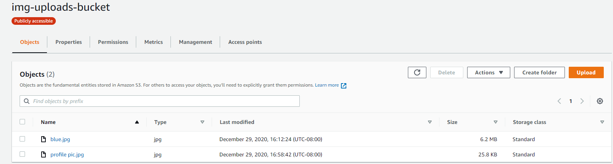
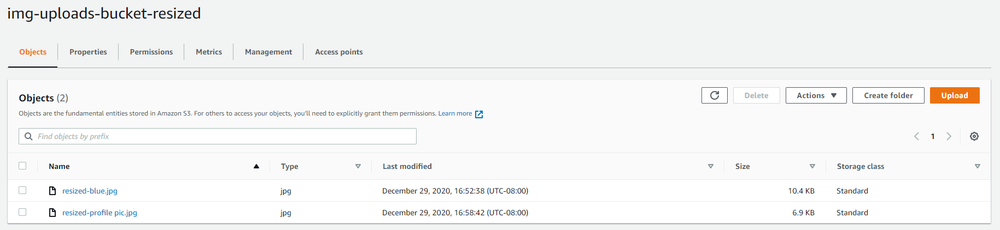

# Lab 17 Dina Ayoub

Code for resizing from [Amazon docs](https://docs.aws.amazon.com/lambda/latest/dg/with-s3-example.html)

## How to use my lambda

You upload an image to the bucket "img-uploads-bucket" and then you will find the resized version of it in the "img-uploads-bucket-resized"

## Issues

I really had too many to remember. The biggest challenge was that the google result i worked from for a long time was dated, so i couldn't find the things they kept referring to.

## Image and thumbnail my lambda processed

Original files:

Link: https://img-uploads-bucket.s3-us-west-2.amazonaws.com/blue.jpg

Link: https://img-uploads-bucket.s3-us-west-2.amazonaws.com/profile+pic.jpg

Resized files:

(https://img-uploads-bucket-resized.s3-us-west-2.amazonaws.com/resized-blue.jpg

Link: https://img-uploads-bucket-resized.s3-us-west-2.amazonaws.com/resized-profile+pic.jpg

Shown in AWS:

